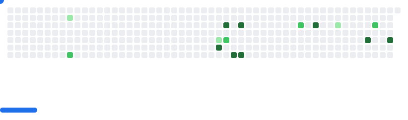

## Hi there, I'm Christian 👋

### About me! 🤓
A software engineer with a backend-leaning focus, building reliable, well-architected applications across the stack.

```
{
  "frontend": {
    "summary": "Creating responsive, interactive user interfaces with reusable components that promote consistency and efficiency across applications.",
    "stack": ["TypeScript", "Angular", "React", "Blazor", "Next.js"]
  },
  "backend": {
    "summary": "Designing and optimizing APIs, managing relational databases, and improving legacy systems for better performance and reliability.",
    "stack": ["C#", ".NET", "Rust", "Go", "Ruby on Rails"]
  },
  "infrastructure": {
    "summary": "Deploying and scaling applications with containerization, cloud infrastructure, and event-driven data pipelines.",
    "stack": ["Docker", "Azure", "Kafka", "Redis"]
  },
  "interests": ["Tech", "Gaming"]
}
```

---

<picture>
  <source
    media="(prefers-color-scheme: dark)"
    srcset="images/breakout-dark.svg"
  />
  <source
    media="(prefers-color-scheme: light)"
    srcset="images/breakout-light.svg"
  />
  
</picture>

*Built with* [cyprieng/github-breakout](https://github.com/cyprieng/github-breakout)
